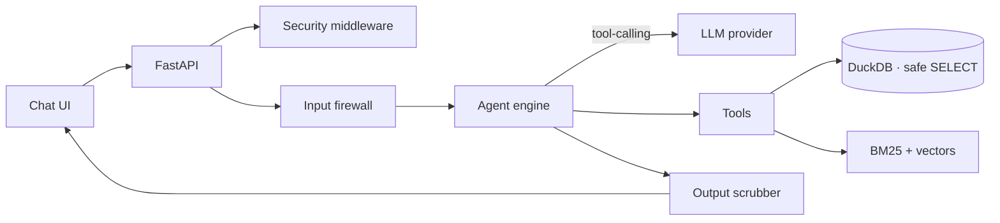

# RAG Analytics Assistant

This repository is a working public prototype over synthetic interview-demo data. It is not a production deployment or a claim of measured latency.

An **LLM-first, guardrailed** question-answering assistant over your own **tabular data** (CSV → DuckDB)
and **documents** (Markdown/text → hybrid retrieval). Ask a question in plain English; the assistant
decides whether to run a safe SQL query, search the documents, or both — then answers with its sources.

The public prototype uses Groq's OpenAI-compatible API with openai/gpt-oss-120b. Retrieval uses local
hashing vectors plus BM25; these are not trained semantic embeddings. Drop new files into the data folder
and the watcher re-indexes them automatically.

> This is a clean, general-purpose reference implementation. It ships with **synthetic** demo data only.

## Why it's different from a "normal chatbot"

A normal chatbot hard-codes intents and bolts an LLM on as an afterthought. Here the **LLM is the brain**:
it plans, calls tools (`run_sql`, `search_docs`), reads the results, and synthesizes an answer — while a
**deterministic safety layer** wraps every call so the model can never run unsafe SQL, leak secrets, or be
hijacked by injected instructions.

## Features

- **Agentic core** — native tool-calling loop (`run_sql` + `search_docs`), multi-turn conversation memory.
- **Safe SQL** — single read-only `SELECT` only; DDL/DML, file-readers, internal tables, and stacked
  statements are rejected; row limits are clamped.
- **Pluggable LLM providers** — OpenAI (or any OpenAI-compatible endpoint), **AWS Bedrock**, or any
  **local CLI** (e.g. the ChatGPT/Codex CLI on an existing subscription). One interface, swap freely.
- **Hybrid retrieval** — BM25 (lexical) + dense vectors fused with reciprocal-rank fusion.
- **Guardrails in & out** — input firewall (injection / exfiltration / code-request / unsafe-SQL /
  format-hijack) and an output scrubber that redacts leaked secrets and a leaked system prompt.
- **LLM-first (required)** — every analytical answer is produced by a live model; with no provider
  configured the app refuses to start rather than guessing (override with `REQUIRE_LLM=false`).
- **Auto-ingest** — drop a CSV / Markdown / text file into the data dir and a background watcher
  embeds and indexes it on the fly; no restart, no manual step. Local hashing embeddings mean
  vectorization needs no model download or API key.
- **Atomic ingestion** — table reloads build a temp table and swap, so a failed load never destroys data.
- **Hardened HTTP** — body-size limit, per-IP rate limiting, optional API key, security headers.
- Tested, linted, and CI-wired.

## Architecture



## Quickstart

```bash
make setup
make sample-data
make test
make run
python scripts/evaluate_demo.py --base-url http://127.0.0.1:8000 --runs 20 --output evaluation.json
```

The repo ships with 15 synthetic files: 1 CSV, 8 invoice examples, 2 text PDFs, 1 DOCX, and reference
documents. Supported inputs are CSV, Markdown/text, text PDFs, and DOCX; PDF extraction has no OCR.

This assistant is **LLM-first**, so before `make run` copy `env.example` to `.env` and configure one
provider (below) — without a model the server refuses to start. Then open <http://127.0.0.1:8000> and
ask: *"What was total revenue by region?"* or *"What does baseline mean?"*

To add your own data, just drop `.csv` (tables) or `.md` / `.txt` (documents) into the data dir — the
running app picks them up, embeds, and indexes them automatically within seconds.

## LLM providers

Set `LLM_PROVIDER` (or leave it `auto`) and configure one backend:

| Provider | `LLM_PROVIDER` | Configure | Notes |
|----------|----------------|-----------|-------|
| OpenAI / compatible | `openai` | `OPENAI_API_KEY`, `OPENAI_MODEL`, `OPENAI_BASE_URL` | Native tool-calling. Works with any OpenAI-compatible endpoint. |
| AWS Bedrock | `bedrock` | `pip install boto3`, `BEDROCK_MODEL_ID`, `AWS_REGION` + AWS creds | Native tool use via the Bedrock `converse` API. |
| Local CLI | `cli` | `LLM_CLI_COMMAND` | Any CLI that reads the prompt on stdin and writes the answer on stdout — e.g. the ChatGPT/Codex CLI on an existing subscription (no API key). Uses a text-based tool protocol. |
| None | `none` | — | Disables the model. The app refuses to start unless `REQUIRE_LLM=false`, in which case it answers every question with a "configure a provider" message. |

`auto` picks the first that's configured: OpenAI → Bedrock → CLI. If none is configured the app
refuses to start (set `REQUIRE_LLM=false` to boot without a model).

## Configuration

All settings come from environment variables (or `.env`). See [`env.example`](env.example) for the
full list — API key, rate limits, LLM providers, embedding provider, and ingestion limits.

## How it works

1. **Guard** inspects the question (length, injection/exfiltration/scope) before anything else.
2. **Engine** builds a system prompt (armor + live schema + document summary) and runs the LLM
   tool-calling loop; tools execute against DuckDB and the retriever.
3. **Scrubber** redacts any leaked secret/prompt/code from the final text.
4. **Auto-ingest** watches the data dir: add or change a CSV / Markdown / text file and it is
   re-embedded and re-indexed on the fly (the `/refresh` endpoint runs the same reindex manually).

## Project layout

```
app/
  main.py            FastAPI app + routes
  middleware.py      body limit, rate limit, API key, security headers
  config.py          env-driven settings
  security/          input firewall, output scrubber, system-prompt armor
  data/              DuckDB store (safe SELECT, atomic load), ingestion, auto-reindex watcher, BM25
  rag/               embeddings, in-memory vector index, hybrid retriever
  agent/             tools, LLM providers, memory, engine
  ui/chat.html       single-file chat UI
scripts/             synthetic data generator
tests/               pytest suite
```

## Security

The safety layer limits common failure modes; it cannot guarantee that a provider or model never leaks
content or is never manipulated. SQL safety uses disabled DuckDB external access, parsed table allowlists,
read-only SELECT checks, and a returned-row cap (which does not bound aggregate work). Inputs are screened,
tool/document content is treated as data, and outputs are scrubbed. See `app/security/` and `app/data/store.py`.

## License

MIT — see [LICENSE](LICENSE).

Further details: docs/ARCHITECTURE.md, docs/OPERATIONS.md, docs/MODELS-LICENSES-COSTS.md, and docs/DEPLOYMENT.md.
