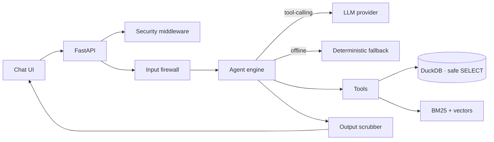

# RAG Analytics Assistant

An **LLM-first, guardrailed** question-answering assistant over your own **tabular data** (CSV → DuckDB)
and **documents** (Markdown/text → hybrid retrieval). Ask a question in plain English; the assistant
decides whether to run a safe SQL query, search the documents, or both — then answers with its sources.

It runs **fully offline** with a deterministic fallback (no API key required), and upgrades to a
real **tool-calling agent** the moment you connect a language model.

> This is a clean, general-purpose reference implementation. It ships with **synthetic** demo data only.

## Why it's different from a "normal chatbot"

A normal chatbot hard-codes intents and bolts an LLM on as an afterthought. Here the **LLM is the brain**:
it plans, calls tools (`run_sql`, `search_docs`), reads the results, and synthesizes an answer — while a
**deterministic safety layer** wraps every call so the model can never run unsafe SQL, leak secrets, or be
hijacked by injected instructions.

## Features

- **Agentic core** — native tool-calling loop (`run_sql` + `search_docs`), multi-turn conversation memory.
- **Safe SQL** — single read-only `SELECT` only; DDL/DML, file-readers, internal tables, and stacked
  statements are rejected; row limits are clamped.
- **Hybrid retrieval** — BM25 (lexical) + dense vectors fused with reciprocal-rank fusion.
- **Guardrails in & out** — input firewall (injection / exfiltration / code-request / unsafe-SQL /
  format-hijack) and an output scrubber that redacts leaked secrets and a leaked system prompt.
- **Offline by default** — deterministic hashing embeddings + a fallback answerer; zero external calls
  until you set `OPENAI_API_KEY`.
- **Atomic ingestion** — table reloads build a temp table and swap, so a failed load never destroys data.
- **Hardened HTTP** — body-size limit, per-IP rate limiting, optional API key, security headers.
- Tested, linted, and CI-wired.

## Architecture



## Quickstart

```bash
make setup          # create venv + install deps
make test           # run the test suite
make run            # serve at http://127.0.0.1:8000
```

The repo ships with synthetic demo data already generated in `data/sample/`. Regenerate it any time
with `make sample-data`.

Then open <http://127.0.0.1:8000> and ask: *"What was total revenue by region?"* or
*"What does baseline mean?"*

To enable the full agent, copy `env.example` to `.env` and set `OPENAI_API_KEY` (and `OPENAI_MODEL`
to a model you have access to).

## Configuration

All settings come from environment variables (or `.env`). See [`env.example`](env.example) for the
full list — API key, rate limits, LLM provider/model, embedding provider, and ingestion limits.

## How it works

1. **Guard** inspects the question (length, injection/exfiltration/scope) before anything else.
2. **Engine** builds a system prompt (armor + live schema + document summary) and runs the LLM
   tool-calling loop; tools execute against DuckDB and the retriever.
3. **Scrubber** redacts any leaked secret/prompt/code from the final text.
4. With no model configured, a **deterministic fallback** answers schema and document questions and
   honestly declines free-form analysis rather than guessing.

## Project layout

```
app/
  main.py            FastAPI app + routes
  middleware.py      body limit, rate limit, API key, security headers
  config.py          env-driven settings
  security/          input firewall, output scrubber, system-prompt armor
  data/              DuckDB store (safe SELECT, atomic load), ingestion, BM25
  rag/               embeddings, in-memory vector index, hybrid retriever
  agent/             tools, LLM provider, memory, deterministic fallback, engine
  ui/chat.html       single-file chat UI
scripts/             synthetic data generator
tests/               pytest suite
```

## Security

The deterministic safety layer holds even if the model misbehaves. SQL safety is enforced in three
layers rather than a (bypassable) denylist: the DuckDB connection has **external file access
disabled**, every query is **parsed and checked against a table allowlist**, and results are
**hard-capped by an outer LIMIT**. Untrusted tool/document content is never treated as instructions,
and outputs are scrubbed for leaked secrets/prompt. See `app/security/` and `app/data/store.py`.

## License

MIT — see [LICENSE](LICENSE).
