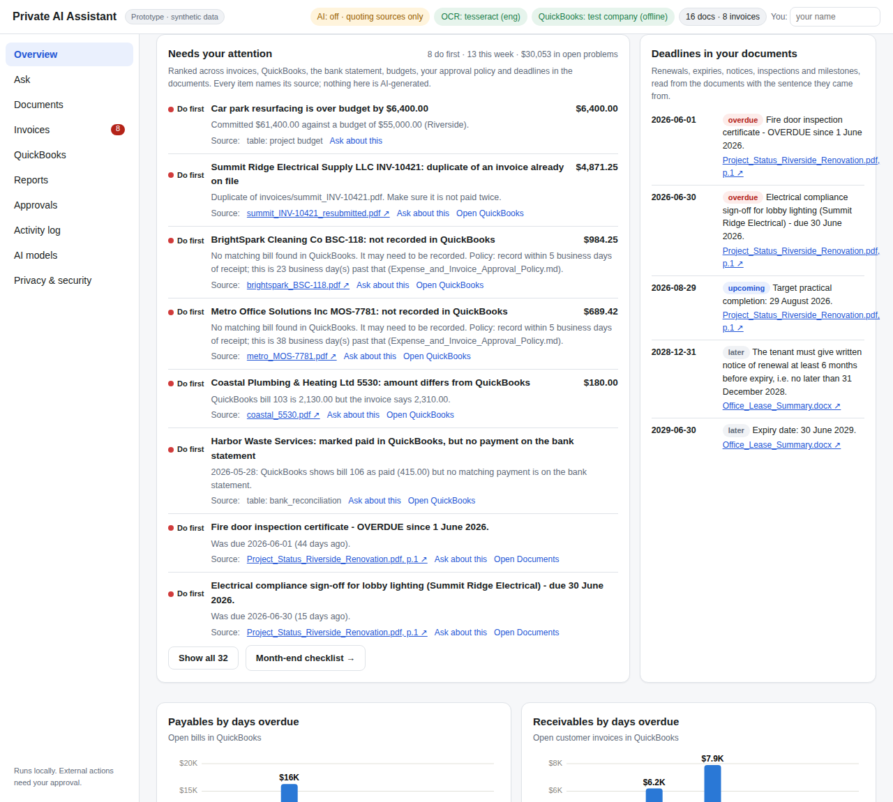
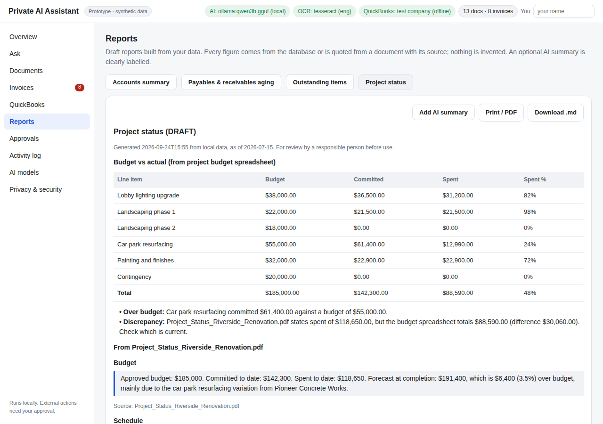
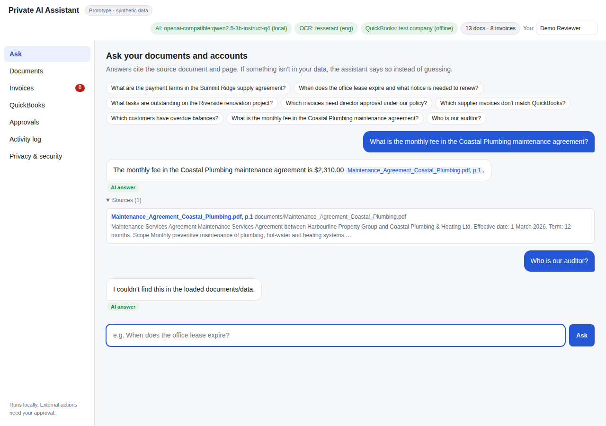
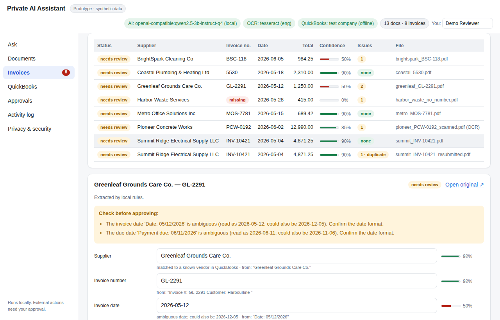
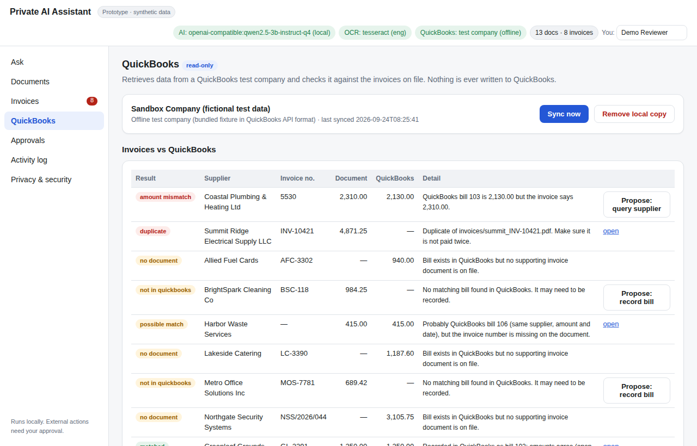
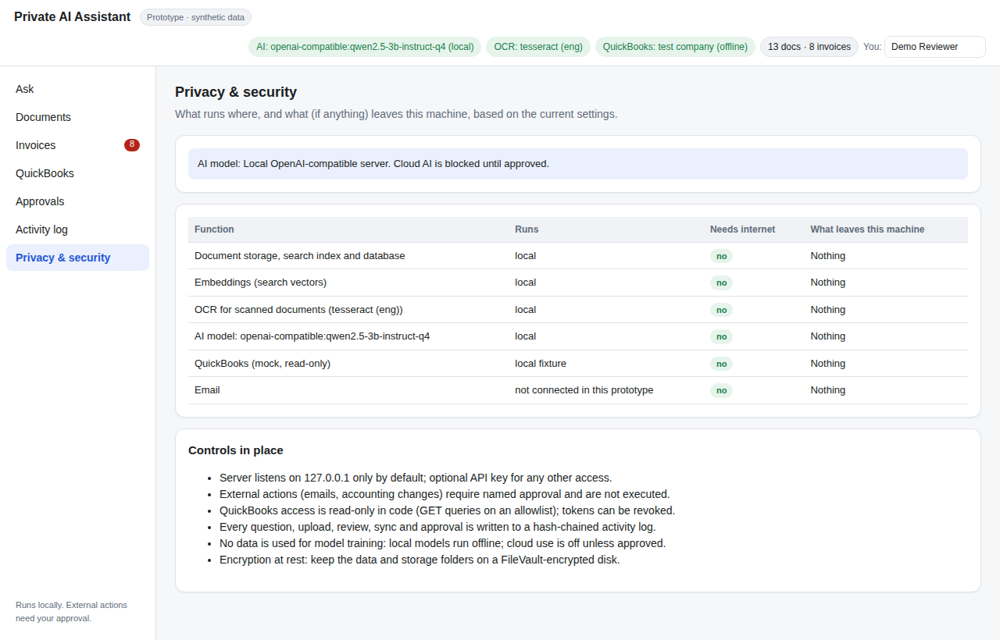
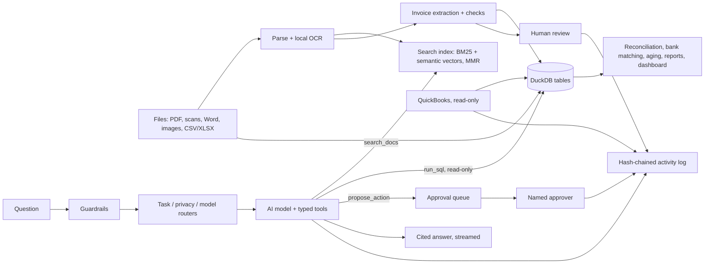

# Private AI Assistant — working prototype

A secure, **local-first** AI assistant for a small business, built to run on a Mac Studio. It finds
information in company documents and answers **with references to the original source**, reads invoices
(including scans) into a structured table, pulls data from a **QuickBooks Online test company through a
read-only workflow**, and flags anything missing, inconsistent or uncertain instead of guessing.

> Everything in this repository uses **synthetic, fictional data** (a made-up property company, suppliers,
> contracts, invoices, bank lines and QuickBooks sandbox company). No real company data, passwords or
> credentials are needed to run it.

| Overview: KPIs, aging, spend, cash flow, budget charts | Reports: draft reports with sources and discrepancies |
|---|---|
|  |  |
| **Ask: cited answers, "not found" when it isn't there** | **Invoices: extracted fields, confidence, flags** |
|  |  |
| **QuickBooks: read-only sync + reconciliation** | **Privacy: what runs where** |
|  |  |

<sub>Screenshots from this repository's test environment, using a small 3B model on CPU through a local
OpenAI-compatible server. On the Mac Studio the recommended model is Qwen 2.5 14B via Ollama.</sub>

## What the prototype demonstrates

| Requirement (first prototype) | How it's met | Where to see it |
|---|---|---|
| Load a set of sample company documents and invoices | 5 synthetic company documents (PDF, Word, Markdown) plus 4 **real public documents** (a 28-page IRS PDF, a GOV.UK Word file, an OWASP page, a country-codes CSV; see [PUBLIC-DOCUMENTS.md](docs/PUBLIC-DOCUMENTS.md)), 8 supplier invoices incl. a **scanned** PDF, a bank statement (XLSX) and a project budget (CSV). Drop more into the folder or upload in the UI; they're indexed automatically. | **Documents** tab |
| Answer questions and show the supporting sources | Hybrid search (keyword + vector) → local AI model writes a cited answer (`[file, p.N]`); each source links to the original at the right page. With no AI model it quotes the best passages instead of inventing text. | **Ask** tab |
| Extract supplier, date, invoice number and amount | Label-aware extraction from layout text (OCR for scans), plus due date, PO, subtotal, tax, currency, each with a confidence score and the line it was read from. The AI model can assist, but its values are only accepted if they appear on the document. | **Invoices** tab, `GET /invoices/export.csv` |
| Retrieve information from a QuickBooks test company, read-only | Pulls vendors, bills, customer invoices and accounts into local tables; reconciles them against the invoices on file (matched / amount mismatch / not recorded / duplicate / bill with no document). Read-only is enforced in code. | **QuickBooks** tab |
| Present results through a simple interface | Single-page web app at `http://127.0.0.1:8000`, works on desktop and phone. | — |
| Flag missing or uncertain information instead of inventing answers | Missing fields, ambiguous dates (`05/12/2026`), totals that don't add up, duplicates, OCR input and AI/rule disagreements are all flagged; every extraction starts as *needs review*. Questions the documents can't answer get "I couldn't find this". | Invoices, Ask |
| Useful results on documents it has not processed before | `data/unseen_invoices/` holds invoices in new layouts (incl. a phone-photo PNG, plain-text and AED invoices). Upload them live, or paste any invoice's text into the **Invoice lab**: fields are read with the line they came from, and unreadable totals or quantity × price mismatches are flagged. | Documents → upload, Invoices → Invoice lab |
| External actions need explicit approval | The assistant can only *propose* an email or a QuickBooks entry. A named person approves or rejects it; in this prototype approved actions are logged but not executed. | **Approvals** tab |
| Use any AI provider, safely | Add any API key (Claude, OpenAI, Gemini, OpenRouter, Azure, Groq, Mistral, DeepSeek, Together, xAI, Bedrock) and/or local Ollama. A **task router** picks the pipeline per request, a **model router** handles fast/strong tiers, fallback, circuit breaking, tokens and cost, and a **privacy router** keeps accounting, invoice, bank and high-risk personal data on local models and masks PII sent to the cloud. Model outputs and tool calls are **type-checked** (Pydantic). | **AI models** tab, answer trace, [docs/LLM-ROUTING.md](docs/LLM-ROUTING.md) |
| Graphs, reports and accounting checks | **Overview** dashboard: KPIs, payables/receivables aging, spend by supplier, cash flow and budget vs. actual, drawn as accessible SVG charts (table view included). Bank lines are matched to QuickBooks bills and receipts, invoice line items are checked against subtotals, and draft reports (accounts summary, aging, outstanding items, project status) are built from the data with each figure's source, flagging where a document and a spreadsheet disagree. | **Overview**, **Reports** tabs |
| Answers that feel fast, search that understands wording | Answers **stream** word by word (SSE) with live status (route, model, tools used). Search mixes keywords with **semantic embeddings** (local `nomic-embed-text` via Ollama, cached on disk), removes near-duplicate passages (MMR) and can be re-ranked by a local model. | **Ask** tab |
| Activity logs, access control, revocation, local processing | Tamper-evident (hash-chained) activity log; binds to 127.0.0.1 with optional API key; QuickBooks disconnect revokes tokens and deletes the local copy; a live page states what runs where and what leaves the machine. | **Activity log**, **Privacy & security** tabs |
| Ready to run as a service | Strict Content-Security-Policy, request IDs carried into every log line and activity entry, JSON logs, Prometheus `/metrics`, `/ready` health check, startup config warnings, checksummed backup/restore, and a hardened Docker image (read-only, non-root). | [docs/OPERATIONS.md](docs/OPERATIONS.md) |

Measured results on the synthetic set (from `make evaluate`, see [docs/TEST-RESULTS.md](docs/TEST-RESULTS.md)):
11/11 invoices extracted with every field correct (including 3 unseen layouts, a scan and a photo),
5/5 planted problems flagged, 10/10 search questions return the right document first, 3/3 unanswerable
questions answered "not found", 8/8 invoices reconciled correctly against QuickBooks, 8/8 bank lines
classified correctly, 11/11 invoices with correct line items, 7/8 reworded questions found by semantic search.

## Share it without installing: hosted public demo

`PUBLIC_DEMO=true` turns the same app into a read-only, stateless demo (no uploads, reviews, approvals or
QuickBooks changes; no conversation memory) for hosting on Vercel behind an optional Cloudflare Worker
under your own domain, with a hosted model such as Groq's `openai/gpt-oss-120b`. Synthetic and public
data only. Setup, environment variables and the proxy: [docs/DEPLOYMENT.md](docs/DEPLOYMENT.md).
Check any running install end to end with `python scripts/evaluate_live.py --base-url <url>`.

## Using your own API key

```bash
cp env.example .env
# in .env:
ALLOW_CLOUD_AI=true
ANTHROPIC_API_KEY=...        # and/or OPENAI_API_KEY, GEMINI_API_KEY, OPENROUTER_API_KEY, ...
make run
```

Details, per-provider settings, fallback chains, cost tracking and the privacy policy:
[docs/LLM-ROUTING.md](docs/LLM-ROUTING.md).

## Quick start

```bash
make setup      # Python venv + dependencies
make run        # http://127.0.0.1:8000
```

That's enough for a complete offline demo. For the best experience on a Mac also install local OCR and a
local AI model (≈10 minutes; nothing leaves the machine):

```bash
brew install tesseract ollama
ollama serve &                   # or open the Ollama app
ollama pull qwen2.5:14b          # ~9 GB; runs on Apple Silicon GPU
ollama pull nomic-embed-text     # ~270 MB; semantic search (picked up automatically)
make run
```

Full Mac Studio instructions: [docs/INSTALL-MAC.md](docs/INSTALL-MAC.md). A 10-minute demo script:
[docs/DEMO-SCRIPT.md](docs/DEMO-SCRIPT.md). `make demo` starts with a fixed "as of" date so the aging
figures match the sample data.

Or run it in a container: `make docker-up` (bound to 127.0.0.1:8000; talks to Ollama on the host).

## What runs locally, and what needs the internet

| Function | Default | Internet? | What leaves the Mac |
|---|---|---|---|
| Document storage, search index, database | local | no | nothing |
| OCR for scanned documents (Tesseract) | local | no | nothing |
| AI model (Ollama, e.g. Qwen 2.5) | local | no | nothing |
| Cloud AI (any provider you add a key for) | **blocked** until `ALLOW_CLOUD_AI=true` | yes | only data classes you allow (default: documents), with emails/phones/account numbers masked; accounting, invoice and bank data stay local |
| QuickBooks — offline test company (default) | local fixture | no | nothing |
| QuickBooks — live Intuit sandbox (optional) | Intuit API | yes | OAuth sign-in + read-only queries; data is downloaded, never uploaded |

The **Privacy & security** tab shows this table live, based on the actual configuration. Details:
[docs/SECURITY-PRIVACY.md](docs/SECURITY-PRIVACY.md).

## How it works

The full architecture, with diagrams of every flow (request lifecycle, routers, ingestion, invoices,
accounting, security layers, observability, deployment), is in [docs/ARCHITECTURE.md](docs/ARCHITECTURE.md).



- **Guardrails** block prompt injection, credential fishing and unsafe SQL before anything runs; outputs
  are scrubbed for leaked secrets. SQL is read-only and limited to known tables with no file access.
- **The AI model is optional.** Without one, the app still extracts invoices, reconciles with QuickBooks
  and answers questions by quoting sources. With one (local by default), it composes cited answers,
  queries the tables and drafts actions for approval.

## Project layout

```
app/
  main.py              web API + routes          workspace.py   end-to-end pipeline
  documents/           PDF/Word/image parsing, local OCR
  invoices/            field extraction, checks, review state
  integrations/        QuickBooks Online client (read-only, OAuth 2.0) + offline sandbox
  accounting/          QuickBooks → tables, reconciliation, bank matching, analytics, reports
  llm/                 providers (Claude, OpenAI-compatible family, Azure, Gemini, Bedrock, Ollama, CLI),
                       model/task/privacy routers, typed schemas, structured outputs
  agent/               typed tools, conversation memory, engine, SSE streaming
  rag/ data/           search index, DuckDB store (read-only SQL), ingestion, auto-reindex
  security/            input guardrails, output scrubber, system-prompt armour
  observability.py     request IDs, JSON logs, metrics      approvals.py audit.py
  ui/                  the web interface (index.html, app.js, dependency-free SVG charts.js)
data/                  synthetic sample data, unseen invoices, QuickBooks fixture, ground truth
scripts/               sample-data generator, offline evaluation, live HTTP evaluation, backup/restore
tests/                 220+ automated tests (Python) + Cloudflare Worker tests (Node)
deploy/                Cloudflare Worker proxy for the hosted demo
Dockerfile, docker-compose.yml
docs/                  install, operations, QuickBooks, security, dependencies, results, roadmap
```

## Documentation

| Document | Contents |
|---|---|
| [ARCHITECTURE.md](docs/ARCHITECTURE.md) | How everything works end to end, with diagrams |
| [LLM-ROUTING.md](docs/LLM-ROUTING.md) | API keys for any provider, model/task/privacy routing, type-safe outputs |
| [INSTALL-MAC.md](docs/INSTALL-MAC.md) | Installing on a Mac Studio, choosing a model, starting automatically |
| [DEMO-SCRIPT.md](docs/DEMO-SCRIPT.md) | Step-by-step demo walkthrough |
| [OPERATIONS.md](docs/OPERATIONS.md) | Day-to-day use, backups, updates, troubleshooting |
| [QUICKBOOKS.md](docs/QUICKBOOKS.md) | Connecting an Intuit sandbox company (read-only) |
| [SECURITY-PRIVACY.md](docs/SECURITY-PRIVACY.md) | Data flows, controls, credentials, revocation |
| [DEPENDENCIES.md](docs/DEPENDENCIES.md) | Models, software, licences and recurring costs |
| [DEPLOYMENT.md](docs/DEPLOYMENT.md) | Mac, Docker, or the hosted public demo (Vercel + Cloudflare Worker) |
| [PUBLIC-DOCUMENTS.md](docs/PUBLIC-DOCUMENTS.md) | The real public documents in the sample data, with sources and licences |
| [TEST-RESULTS.md](docs/TEST-RESULTS.md) | Measured results on the sample and unseen documents |
| [ROADMAP.md](docs/ROADMAP.md) | Known limitations and proposed next stages |

## License

MIT — see [LICENSE](LICENSE).
