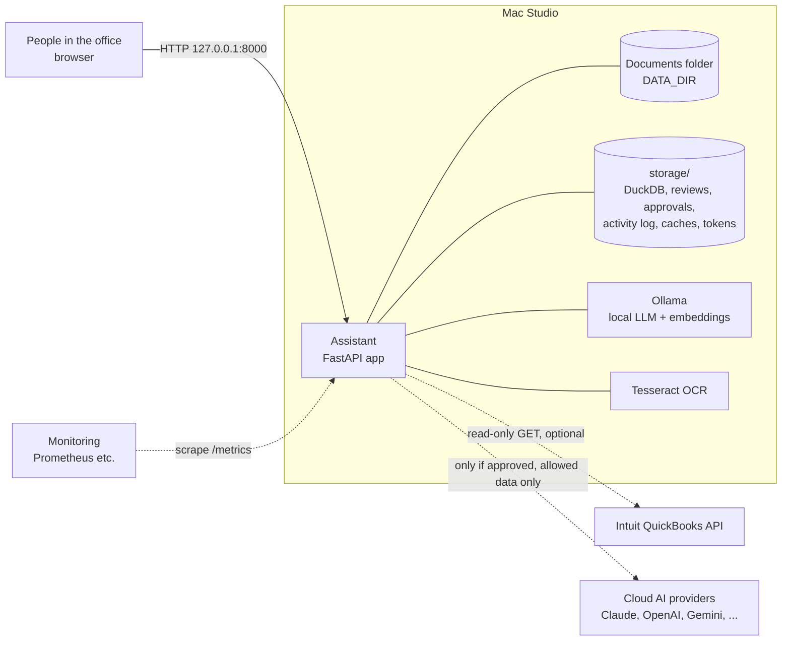
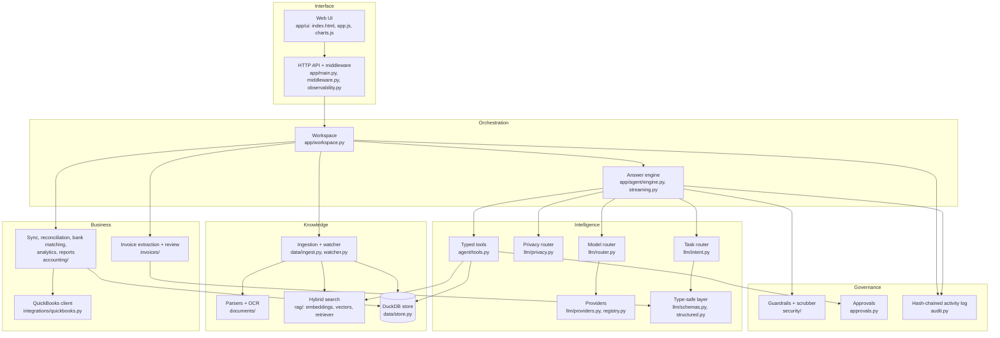
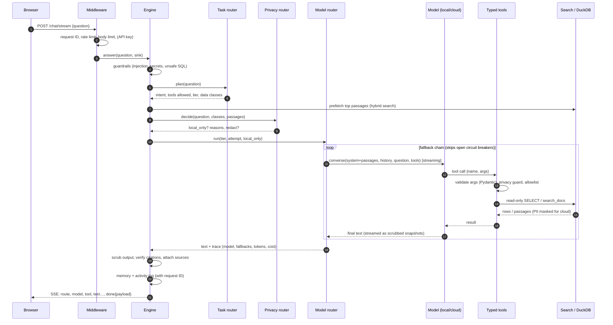
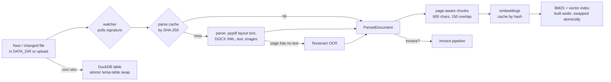
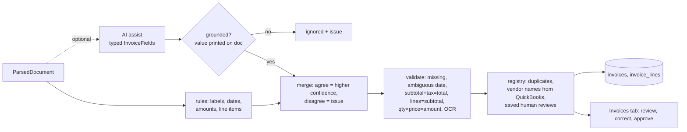
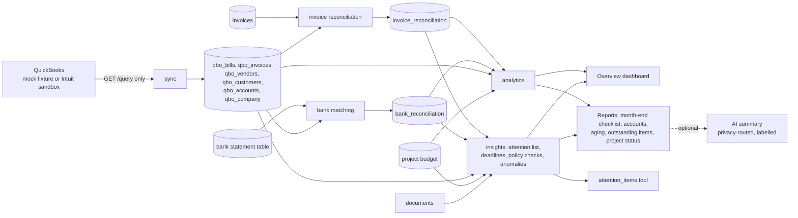
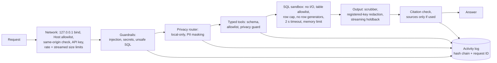
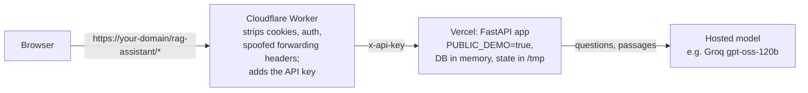

# Architecture: how it works end to end

This document explains every moving part of the Private AI Assistant: what each component does, how
a request flows through the system, where data lives, what crosses the machine boundary, and how it
is secured, observed and deployed. File references point to the code.

## 1. Design principles

| Principle | What it means in the code |
|---|---|
| **Local-first** | Documents, database, search index, OCR and (recommended) the AI model all run on one Mac. Cloud AI is off until the owner sets `ALLOW_CLOUD_AI=true`. |
| **Never invent** | Figures come from SQL or are quoted from documents with their source. AI-extracted values must appear on the document. Missing data is flagged, not filled. |
| **AI is optional, safety is not** | Every feature works without a model (rules, SQL, quoting). The model adds reasoning and writing; deterministic layers around it enforce safety regardless of what it outputs. |
| **Humans decide** | Extractions start as *needs review*; external actions are only *proposed*; a named person approves. Nothing is executed in this stage. |
| **Defence in depth** | Guardrails → privacy routing → typed tool validation → read-only SQL sandbox → output scrubbing → citation check → audit log. Each layer assumes the one before it can fail. |
| **Observable** | Every request has an ID that appears in logs, the activity log and metrics; every model call is measured. |

## 2. System context

Everything inside the box works with no internet. The two dashed arrows are the only external
connections, and both are off by default (QuickBooks runs from an offline sandbox fixture; cloud AI is
blocked).

## 3. Component map

| Layer | Modules | Responsibility |
|---|---|---|
| Interface | `app/ui/*`, `app/main.py` | Single-page UI (no build step, no external scripts), JSON + SSE API |
| Middleware | `app/middleware.py`, `app/observability.py` | Request IDs, access logs, metrics, body limits, rate limit, API key, security headers + CSP |
| Orchestration | `app/workspace.py` | Owns every component; runs reindex → extract → reconcile; builds dashboard, reports, privacy view |
| Answering | `app/agent/engine.py`, `streaming.py`, `tools.py`, `memory.py` | Guarded, routed, tool-using answer loop; streaming; per-session memory |
| Model layer | `app/llm/*` | 13 provider types behind one interface; model / task / privacy routers; typed outputs |
| Knowledge | `app/documents/*`, `app/data/*`, `app/rag/*` | Parse + OCR, chunk, embed, hybrid search, spreadsheets → SQL |
| Business | `app/invoices/*`, `app/integrations/*`, `app/accounting/*` | Invoice fields + line items, QuickBooks (read-only), reconciliation, bank matching, analytics, reports |
| Governance | `app/security/*`, `app/approvals.py`, `app/audit.py` | Input firewall, output scrubber, approval gate, tamper-evident log |

## 4. Lifecycle of a question

Step by step, with the code that does it:

1. **Guardrails** (`security/guardrails.py`, `patterns.py`) refuse prompt injection, secret fishing,
   code requests and raw SQL before anything else runs.
2. **Task router** (`llm/intent.py`) picks a pipeline: *documents*, *accounting*, *drafting* or
   *general*. Keyword rules decide first. When they're unsure, a fast model classifies the question
   into a typed `RouteDecision`. The pipeline fixes the tools offered, the model tier and the data
   classes involved.
3. **Retrieve first** (`rag/retriever.py`): BM25 plus vectors, weighted fusion, then MMR diversity. The
   top passages go to the model up front, which also helps small local models.
4. **Privacy router** (`llm/privacy.py`) decides local versus cloud. Data classes come from folders and
   table names; PII detection covers cards (Luhn check), SSNs, IBANs, account numbers, emails and
   phones. Sensitive classes and high-risk identifiers go to local models only. Allowed cloud requests
   have emails, phones and account numbers masked.
5. **Model router** (`llm/router.py`) tries the tier's fallback chain. It skips models whose circuit
   breaker is open and records latency, tokens and cost for every attempt.
6. **Tool loop** (`llm/providers.py` + `agent/tools.py`) uses each provider's native tool calling. Every
   call is validated against its Pydantic schema and checked against the pipeline's allowlist. While a
   cloud model is active, the privacy guard blocks non-allowed tables and passages. SQL then goes
   through the DuckDB sandbox (section 9).
7. **Streaming** (`agent/streaming.py`): progress events plus text snapshots. Each snapshot passes
   through the scrubber, and trailing characters are held back, so a secret can't leak mid-stream.
8. **Post-checks** (`agent/engine.py`): the output is scrubbed, and every `[citation]` is matched
   against what was actually retrieved; unmatched ones are flagged in the UI. Sources are attached only
   if the answer used them.
9. **Record**: conversation memory marks local-only turns so a later cloud model never sees them.
   The activity log gets the question, route, model, sources and SQL, tagged with the request ID.

If no model is allowed or available, step 5 is replaced by **extractive mode**: the best matching
passages are quoted verbatim with sources. If none is relevant, the answer is "I couldn't find this".

## 5. Ingestion pipeline

- `data/watcher.py` compares a (path, size, mtime) signature every few seconds. Reindexing runs in a
  worker thread, and the new index replaces the old one in a single assignment.
- `documents/parsers.py` keeps layout text so labels stay next to values, and records warnings so an
  unreadable scan is flagged instead of silently indexed as empty.
- `rag/embeddings.py` provides offline hashing (default), Ollama (`nomic-embed-text`), or any
  OpenAI-compatible embeddings API. Vectors are cached on disk. If the semantic provider fails, the
  whole index falls back to hashing, because vectors from different models must never be mixed.

## 6. Invoice pipeline

The privacy policy decides whether invoice text may go to a cloud model for AI assist. By default
invoices are not a cloud-allowed class, so AI assist is local only. Reviews and corrections are stored
by file hash, so they survive restarts and renames.

## 7. Accounting pipeline

- **Invoice reconciliation** (`accounting/reconcile.py`): matched, amount mismatch, possible match,
  not in QuickBooks, duplicate, or a QuickBooks bill with no document.
- **Bank matching** (`accounting/bank.py`): money out is matched to paid bills, money in to customer
  payments, by amount plus the name or number on the bank line. It flags payments with no bill, and
  bills marked paid with no bank evidence.
- **Analytics** (`accounting/analytics.py`): aging buckets, spend by supplier, cash flow, budget versus
  actual, KPIs. All of it is SQL, and all of it uses an as-of date (`REPORT_AS_OF`).
- **Insights** (`accounting/insights.py`, `documents/deadlines.py`): one ranked "needs attention" list from
  all of the above plus the documents: deadlines are dates next to deadline words ("due", "notice",
  "expiry"...), with PDF line wraps re-joined; approval thresholds and the recording deadline are parsed
  from the policy document and applied to invoices; unusual (more than twice the supplier's median) and
  repeated bills are flagged. Severity first, then money involved. The model reaches it through the
  `attention_items` tool (local-only for accounting data); with no model, prioritisation questions are
  answered from the list directly.
- **Reports** (`accounting/reports.py`) are drafts in Markdown and printable HTML. They quote document
  sections with sources, and they cross-check figures stated in documents against spreadsheets (e.g.
  a project report whose spend figure disagrees with the budget sheet).

## 8. Model layer

| Part | Role |
|---|---|
| `providers.py` | One interface (`converse`, `complete`, `complete_json`, streaming) for Anthropic (native Messages API), OpenAI, Azure OpenAI, the OpenAI-compatible family (Gemini, OpenRouter, Groq, Mistral, DeepSeek, Together, xAI, LAN servers), Ollama, Bedrock and CLI models. Each reports token usage. |
| `registry.py` | `provider:model` specs, per-provider defaults, fallback chains built from the keys present, cloud-approval gate |
| `router.py` | Fast/strong tiers, fallback, circuit breaker, per-model metrics and cost, `RoutedLLM` adapter for non-chat tasks |
| `intent.py` | Task router: pipelines and their tools, tiers and data classes |
| `privacy.py` | Data classes, PII detection and masking, local-only decisions, ToolBox guard |
| `schemas.py` + `structured.py` | Pydantic contracts for tool arguments, routing decisions, invoice fields and reranking. JSON Schema is generated from the same models; outputs are validated and retried with the errors, and never reach business code unvalidated. |

## 9. Data and storage

| Where | What | Rebuildable? |
|---|---|---|
| `DATA_DIR` | Source documents, invoices, spreadsheets, uploads | No: the source of truth (back it up) |
| `storage/assistant.duckdb` | Spreadsheet tables, `invoices`, `invoice_lines`, `qbo_*`, `invoice_reconciliation`, `bank_reconciliation` | Yes, from `DATA_DIR` + QuickBooks |
| `storage/invoice_reviews.json` | Human review decisions and corrections | No |
| `storage/approvals.json` | Proposed actions and decisions | No |
| `storage/audit.jsonl` | Activity log (hash-chained) | No |
| `storage/cache/parsed`, `storage/cache/embeddings` | OCR/parse results, vectors | Yes |
| `storage/secrets/qbo_tokens.json` (0600) or macOS Keychain | QuickBooks OAuth tokens | Re-connect |

**SQL sandbox** (`data/store.py`): the DuckDB connection runs with external access disabled, so no
file or network reads are possible. Each query is parsed by DuckDB itself and every table checked
against an allowlist. Only a single `SELECT` is allowed, and it is wrapped in a hard row cap. Tables
are reloaded atomically via temp table and swap.

## 10. Security architecture

| Threat | Mitigation |
|---|---|
| Prompt injection in a question or a document | Input firewall; system-prompt armour treats documents and tool results as data; tools are typed and allowlisted; the model can't execute actions, only propose them |
| Data leaving the machine | Cloud off by default; per-class policy; PII masking; tool guard; memory withholding; privacy page shows the live policy |
| Model hallucination | Retrieval-first answers, citation verification, grounded invoice values, deterministic reports, "not found" behaviour |
| Destructive or exfiltrating SQL | DuckDB with no external access, parser-level table allowlist (a CTE named like a real table counts as that table), SELECT-only, row cap |
| Runaway SQL (denial of service) | Row generators (`range`, `generate_series`, `unnest`, any table function, `WITH RECURSIVE`) rejected; each query interrupted after `SQL_TIMEOUT_SECONDS`; connection memory limit |
| Other websites driving the local app (CSRF, DNS rebinding) | Cross-site POSTs rejected (`Sec-Fetch-Site`/`Origin` must match; extra origins only via `ALLOWED_ORIGINS`); unknown `Host` headers rejected (`ALLOWED_HOSTS`) |
| Leaks through follow-up questions | Every table and passage a turn reads is classified; a turn that read local-only data is withheld from cloud models in later history; the intent classifier masks PII before a cloud model sees the question |
| Credential leakage | Keys only in `.env`; configured keys redacted from every answer; token files 0600 or Keychain; secret-pattern scrubber on streamed text |
| Unauthorised QuickBooks changes | GET-only client, query allowlist, production refused, revoke button |
| Tampering with history | Hash-chained activity log: edits and deleted or reordered lines are detected (removing only the newest entries is not; keep off-machine backups). Backups are checksummed and restores reject unlisted files |
| Browser attacks | Strict CSP (`script-src 'self'`, no inline JS), `frame-ancestors 'none'`, nosniff, no-referrer, all untrusted text inserted with `textContent` |
| Path traversal / malicious uploads | Type and size checks, sanitised names, file serving confined to `DATA_DIR`, DOCX read as XML (no macros) |

## 11. Observability

- **Request IDs**: accepted from `X-Request-ID` or generated, returned in the response, attached to
  every log line and activity-log entry, and propagated into streaming worker threads.
- **Structured logs**: one JSON object per line on stderr (`LOG_FORMAT=json`). Events include
  `request`, `model_call`, `startup_complete`, `config_warning` and `unhandled_error`. Question text
  and document content are not logged; they go to the local activity log only.
- **Metrics** (`GET /metrics`, Prometheus text format):
  - `assistant_http_requests_total`, `assistant_http_request_seconds` (by route template)
  - `assistant_llm_calls_total` (model, local, purpose, outcome), `assistant_llm_call_seconds`,
    `assistant_llm_tokens_total`, `assistant_llm_cost_usd_total`
  - gauges for documents, search chunks, invoices, reviews pending, approvals pending, models
- **Health**: `GET /health` (status, version, config warnings, components) and `GET /ready` (database
  and index; returns 503 until ready, used by Docker's healthcheck).
- **In-app**: the AI models tab (per-model calls, failures, latency, tokens, cost, open breakers), each
  answer's "How this was answered" trace, and the Activity log with its integrity badge.

## 12. Deployment

| Topology | How | Notes |
|---|---|---|
| **Mac Studio, native** (recommended) | `make setup && make run`, launchd for autostart ([INSTALL-MAC.md](INSTALL-MAC.md)) | Ollama on the Metal GPU; lowest latency |
| **Docker on the Mac** | `docker compose up -d`, with Ollama running natively via `host.docker.internal` | Read-only container, non-root user, state on a named volume, healthcheck on `/ready` |
| **Linux server** | `make docker-up-ollama` (adds `docker-compose.ollama.yml`) | Ollama in a container (CPU or NVIDIA), declared local via `LOCAL_MODEL_HOSTS` |
| **Office network** | Set `APP_API_KEY`, add the Mac's name to `ALLOWED_HOSTS`, put HTTPS in front (e.g. Caddy), `TRUST_LOOPBACK=false` | Per-user sign-in is a pilot-stage item |
| **Hosted public demo** | Vercel with `PUBLIC_DEMO=true`, optionally behind the Cloudflare Worker in `deploy/` ([DEPLOYMENT.md](DEPLOYMENT.md)) | Read-only and stateless; synthetic and public data only; hosted model |

Run a single worker process: routing metrics, conversation memory and caches live in-process. The
workload is I/O- and model-bound, so one process serves a small office comfortably.

**Backups**: `make backup` writes a checksummed `.tar.gz` of documents and state (caches skipped,
`.env` only with `ARGS=--include-env`). It verifies the activity-log chain first. `make restore`
verifies every checksum and refuses to overwrite existing state without `--force`.

## 13. API reference

| Method | Path | Purpose |
|---|---|---|
| GET | `/` , `/ui/{app.js,charts.js}` | Web UI |
| GET | `/health`, `/ready`, `/metrics` | Status and warnings, readiness, Prometheus metrics |
| POST | `/chat`, `/chat/stream` | Answer a question (JSON, or server-sent events) |
| POST | `/extract` | Invoice lab: read invoice fields from pasted text (rules only, nothing stored) |
| GET/POST | `/documents`, `/upload`, `/refresh`, `/files/{path}` | Document list, upload, reindex, open original |
| GET/POST | `/invoices`, `/invoices/{id}/review`, `/invoices/export.csv` | Extracted invoices, review/correct, export |
| GET/POST | `/qbo/status`, `/qbo/sync`, `/qbo/connect`, `/qbo/callback`, `/qbo/disconnect`, `/qbo/data` | QuickBooks (read-only), OAuth, revoke |
| GET | `/reconciliation`, `/bank-reconciliation` | Invoice and bank matching results |
| GET | `/dashboard` | KPIs and chart series |
| GET | `/insights`, `/deadlines` | Ranked attention list with sources; deadlines read from documents |
| GET/POST | `/reports`, `/reports/{id}`, `/reports/{id}.md`, `/reports/{id}.html`, `/reports/{id}/summary` | Draft reports; optional AI summary |
| GET/POST | `/approvals`, `/approvals/{id}/decision` | Approval queue |
| GET | `/router`, `/privacy`, `/audit` | Models and routing, privacy policy, activity log |

## 14. Extending it

| To add… | Do this |
|---|---|
| A model provider | OpenAI-compatible: add a `ProviderInfo` row in `llm/registry.py`. Otherwise implement `converse`/`complete` in `llm/providers.py`. |
| A tool | Add a Pydantic args model in `llm/schemas.py` (its docstring is the description), handle it in `ToolBox._run`, and list it in the pipelines in `llm/intent.py` that should offer it |
| A pipeline / intent | Add rules and a `PIPELINES` entry in `llm/intent.py` |
| A data class | Extend `classify_file` / `classify_table` in `llm/privacy.py`, or use `SENSITIVE_PATHS` |
| A business system (e.g. email) | Follow `integrations/quickbooks.py`: read-only client, token store, sync to local tables, privacy class, audit events |
| A report | Write a `ReportContext -> markdown` function and register it in `REPORTS` in `accounting/reports.py` |
| A chart | Add a series to `Workspace.dashboard()` and render it with `Charts.*` in `ui/app.js` |

## 15. Limits and scaling notes

- The vector index is an exact in-memory matmul: fine up to tens of thousands of chunks. Beyond that,
  swap in DuckDB VSS or FAISS behind `VectorIndex`.
- DuckDB suits single-machine analytics. A multi-user deployment with concurrent writers would move
  reviews and approvals to a server database.
- Answer speed is dominated by the model. On a Mac Studio, a 14B model answers in seconds; on the
  4-core CPU test machine used for development, a 3B model took about 30–70 s.
