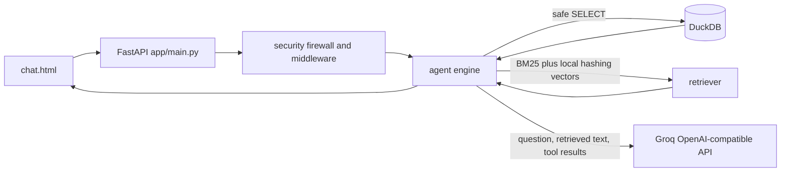

# Architecture

CSV files are loaded into DuckDB; Markdown, text, text PDFs, and DOCX are extracted into chunks. The
retriever combines lexical BM25 with local hashing vectors. PDF extraction is text-only and there is no OCR.
The agent calls run_sql and search_docs, then returns answer text, SQL, rows, timings, and source metadata.

The source paths are app/main.py, app/data/store.py, app/data/ingest.py, app/rag/retriever.py, app/agent/
and app/ui/chat.html. Public hosting is a Vercel FastAPI prototype behind the optional Cloudflare worker.
The public mode is stateless, uses synthetic data, has no QuickBooks refresh, and has not been hardware or
live-latency validated.
