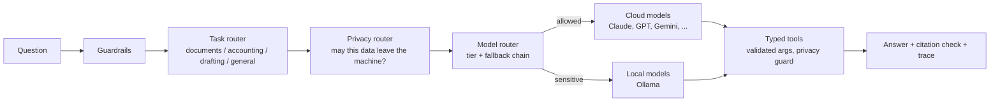
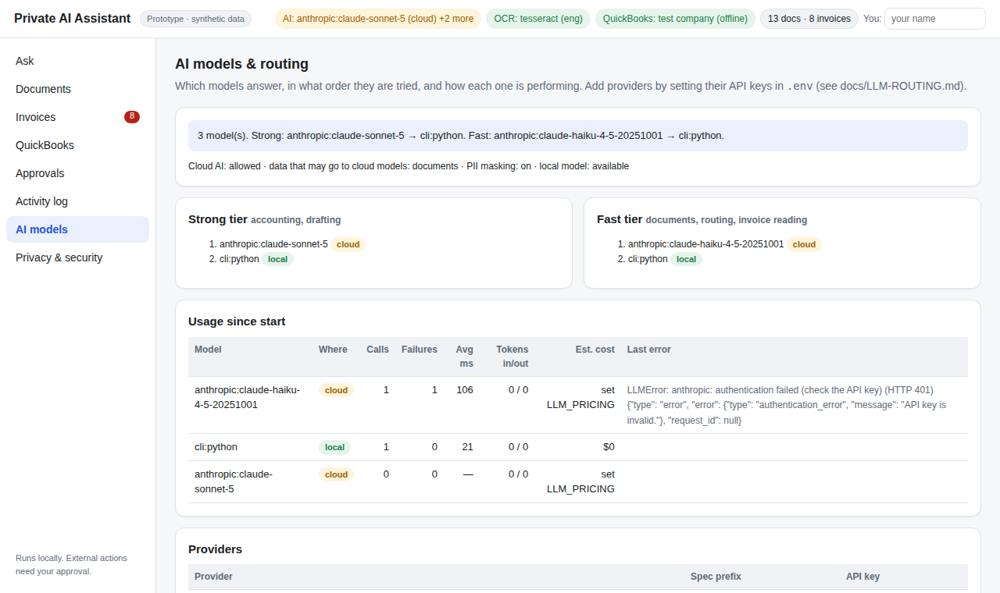

# AI models, routing and type safety

The assistant can use **any mix of cloud and local models**. You add API keys; three routers decide
which model handles each request, and a type-safe layer checks everything that crosses the model
boundary.





<sub>The AI models tab after a request: the cloud model failed (an invalid demo key, HTTP 401) and the
router fell back to the local model.</sub>

## 1. Add your API key(s)

Copy `env.example` to `.env`, set **one or more** keys, and approve cloud use:

```bash
ALLOW_CLOUD_AI=true            # owner approval to use cloud models (default: blocked)
ANTHROPIC_API_KEY=...          # any of the keys below; only providers with a key are used
OPENAI_API_KEY=...
```

| Provider | Key setting | Spec prefix | Default fast / strong model |
|---|---|---|---|
| Anthropic Claude | `ANTHROPIC_API_KEY` | `anthropic:` | `claude-haiku-4-5-20251001` / `claude-sonnet-5` |
| OpenAI | `OPENAI_API_KEY` | `openai:` | `gpt-4o-mini` / `gpt-4o` (`OPENAI_MODEL`, `OPENAI_MODEL_STRONG`) |
| Google Gemini | `GEMINI_API_KEY` | `gemini:` | `gemini-2.5-flash` / `gemini-2.5-pro` |
| OpenRouter (hundreds of models, one key) | `OPENROUTER_API_KEY` | `openrouter:` | `openai/gpt-4o-mini` / `openai/gpt-4o` |
| Azure OpenAI | `AZURE_OPENAI_API_KEY` + `AZURE_OPENAI_ENDPOINT` | `azure:` | set the deployment name explicitly |
| Groq | `GROQ_API_KEY` | `groq:` | `llama-3.1-8b-instant` / `llama-3.3-70b-versatile` |
| Mistral | `MISTRAL_API_KEY` | `mistral:` | `mistral-small-latest` / `mistral-large-latest` |
| DeepSeek | `DEEPSEEK_API_KEY` | `deepseek:` | `deepseek-chat` |
| Together AI | `TOGETHER_API_KEY` | `together:` | set explicitly |
| xAI | `XAI_API_KEY` | `xai:` | set explicitly |
| AWS Bedrock | AWS credentials + `BEDROCK_MODEL_ID` | `bedrock:` | the model id you set |
| Ollama (local) | none | `ollama:` | `OLLAMA_MODEL` / `OLLAMA_MODEL_STRONG` |
| Any OpenAI-compatible server on your network (LM Studio, vLLM) | `OPENAI_API_KEY` (any value) + `OPENAI_BASE_URL=http://…` | `openai:` | treated as **local** |
| Command-line model | `LLM_CLI_COMMAND` | `cli:` | — |

Model names change often. Defaults are only a starting point; list the exact models on your account
with `LLM_MODELS_FAST` / `LLM_MODELS_STRONG` (below). The **AI models** tab shows which keys are set,
which models are active, and any configuration problems.

## 2. Model router: tiers and fallback

| Tier | Used for | Configure |
|---|---|---|
| `fast` | document questions, request classification, invoice field reading | `LLM_MODELS_FAST` |
| `strong` | accounting / SQL questions, drafting emails and reports | `LLM_MODELS_STRONG` |

Each tier is a comma-separated fallback chain of `provider:model` specs. For example:

```bash
LLM_MODELS_FAST=anthropic:claude-haiku-4-5-20251001,openai:gpt-4o-mini,ollama:qwen2.5:14b
LLM_MODELS_STRONG=anthropic:claude-sonnet-5,openai:gpt-4o,ollama:qwen2.5:32b
```

If unset, chains are built from the keys present (cloud first; `LLM_PREFER=local` puts Ollama first).

- **Fallback**: on any error (timeout, rate limit, outage, bad key, invalid output) the next model in
  the chain is tried. If a tier is exhausted, the other tier's models are tried.
- **Circuit breaker**: after `ROUTER_FAILURE_THRESHOLD` (3) consecutive failures a model is skipped for
  `ROUTER_COOLDOWN_SECONDS` (60).
- **Metrics**: calls, failures, latency, input/output tokens per model, visible in **AI models** and
  in each answer's "How this was answered" trace. Token counts come from the provider's response.
- **Cost**: set prices to get estimates (USD per million input/output tokens; check your provider's
  current price list):

  ```bash
  LLM_PRICING={"anthropic:claude-sonnet-5": [3, 15], "openai:gpt-4o-mini": [0.15, 0.6]}
  ```

## 3. Task router

| Intent | Example | Tools offered to the model | Tier | Data classes |
|---|---|---|---|---|
| documents | "What notice is needed to renew the lease?" | `search_docs` | fast | documents |
| accounting | "Which customers have overdue balances?" | `run_sql`, `search_docs` | strong | accounting, bank |
| drafting | "Draft an email to Oakridge about their bill" | `search_docs`, `run_sql`, `propose_action` | strong | documents |
| general | anything else | `search_docs`, `run_sql` | fast | documents |

Keyword rules decide instantly and locally. When they are unsure, a fast model classifies the request
through the type-safe layer (`RouteDecision`), unless `INTENT_MODEL_FALLBACK=false`. Tools outside the
pipeline are not offered to the model, and are refused if it calls them anyway.

## 4. Privacy router

| Setting | Default | Meaning |
|---|---|---|
| `ALLOW_CLOUD_AI` | `false` | master switch; `false` = local models only |
| `CLOUD_ALLOWED_DATA` | `documents` | data classes that may be sent to cloud models: `documents`, `invoices`, `accounting`, `bank`, `personal` |
| `REDACT_PII` | `true` | mask emails, phone numbers, account-like numbers in anything sent to the cloud |
| `SENSITIVE_PATHS` | — | extra folder rules, e.g. `hr/=personal,payroll/=personal` |

Data classes come from where data lives: `invoices/` folders → invoices; bank statements → bank;
QuickBooks tables, extracted invoices, reconciliation → accounting; `SENSITIVE_PATHS` rules → as
configured; everything else → documents.

What happens with the defaults once `ALLOW_CLOUD_AI=true`:

- *"What does the lease say about renewal?"* → cloud model; emails/phones masked.
- *"Which customers are overdue?"* (accounting) → **local model only**. If no local model is running,
  the assistant says so and quotes sources instead of sending the data out.
- A question containing a card number, SSN, IBAN or bank account number → local only.
- Invoice field extraction → local only (`invoices` not in `CLOUD_ALLOWED_DATA`).

Enforcement is layered, so it doesn't rely on the model behaving:

1. **Routing**: sensitive requests get only local candidate models.
2. **Tool guard**: while a cloud model is active, `run_sql` on accounting/bank tables is refused and
   document hits from non-allowed classes are withheld (the rest are masked).
3. **Memory**: earlier local-only turns are replaced with a placeholder before a cloud model sees the
   conversation.

Each answer shows where it was processed ("kept on this machine", "N details masked for cloud").
The **Privacy & security** tab lists the policy in force.

## 5. Type-safe AI layer

Everything crossing the model boundary is typed with Pydantic (`app/llm/schemas.py`):

| Contract | Direction | How it's enforced |
|---|---|---|
| `RunSqlArgs`, `SearchDocsArgs`, `ProposeActionArgs` | model → tools | JSON Schemas sent to providers are generated from these models; every call is validated before running; errors go back to the model so it can correct itself |
| `RouteDecision` | model → task router | structured output, validated |
| `InvoiceFields` | model → invoice extraction | structured output; money strings coerced, placeholders like "N/A" become null; values then must appear on the document |

`app/llm/structured.py` uses each provider's strongest mechanism: OpenAI `json_schema`, JSON mode for
compatible APIs (retrying without it if a model doesn't support it), and **tool forcing** for Claude. It
validates the reply, sends validation errors back for up to 2 retries, then raises
`StructuredOutputError`. Callers fall back to deterministic logic, so invalid output never reaches
business code.

Answers are also checked after generation: every `[citation]` must match a document or table that was
actually retrieved. Unmatched citations are flagged in the UI ("citation not in retrieved sources").

## Recipes

**"I have one OpenAI key"**
```bash
ALLOW_CLOUD_AI=true
OPENAI_API_KEY=sk-...
# accounting questions still need a local model: brew install ollama && ollama pull qwen2.5:14b
```

**"Claude for quality, OpenAI as backup, local for sensitive data"**
```bash
ALLOW_CLOUD_AI=true
ANTHROPIC_API_KEY=...
OPENAI_API_KEY=...
LLM_MODELS_STRONG=anthropic:claude-sonnet-5,openai:gpt-4o,ollama:qwen2.5:32b
LLM_MODELS_FAST=anthropic:claude-haiku-4-5-20251001,openai:gpt-4o-mini,ollama:qwen2.5:14b
```

**"One key, many models" (OpenRouter)**
```bash
ALLOW_CLOUD_AI=true
OPENROUTER_API_KEY=...
LLM_MODELS_STRONG=openrouter:anthropic/claude-sonnet-4.5,openrouter:openai/gpt-4o
```
(Use the exact model slugs listed on openrouter.ai.)

**"Cloud for everything the owner approved, including accounting"**
```bash
ALLOW_CLOUD_AI=true
CLOUD_ALLOWED_DATA=documents,invoices,accounting
```

**"Fully offline"**: leave `ALLOW_CLOUD_AI` unset and run Ollama.
